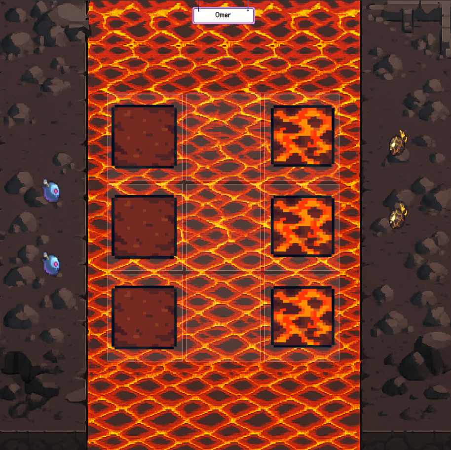
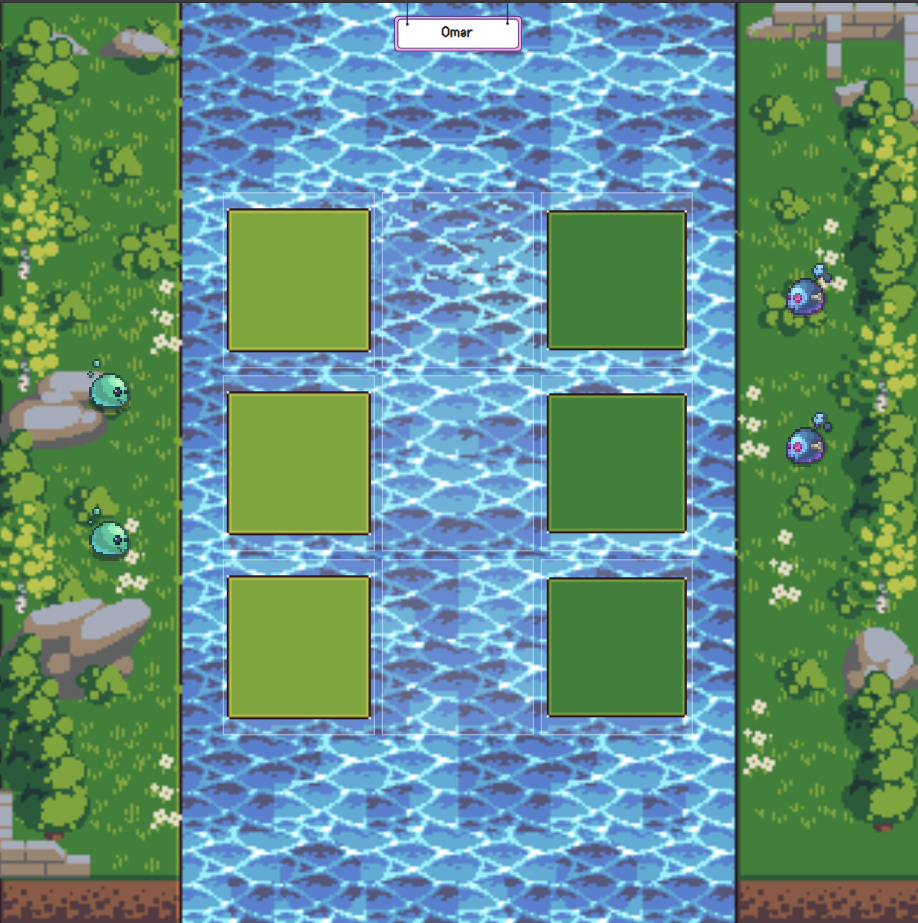
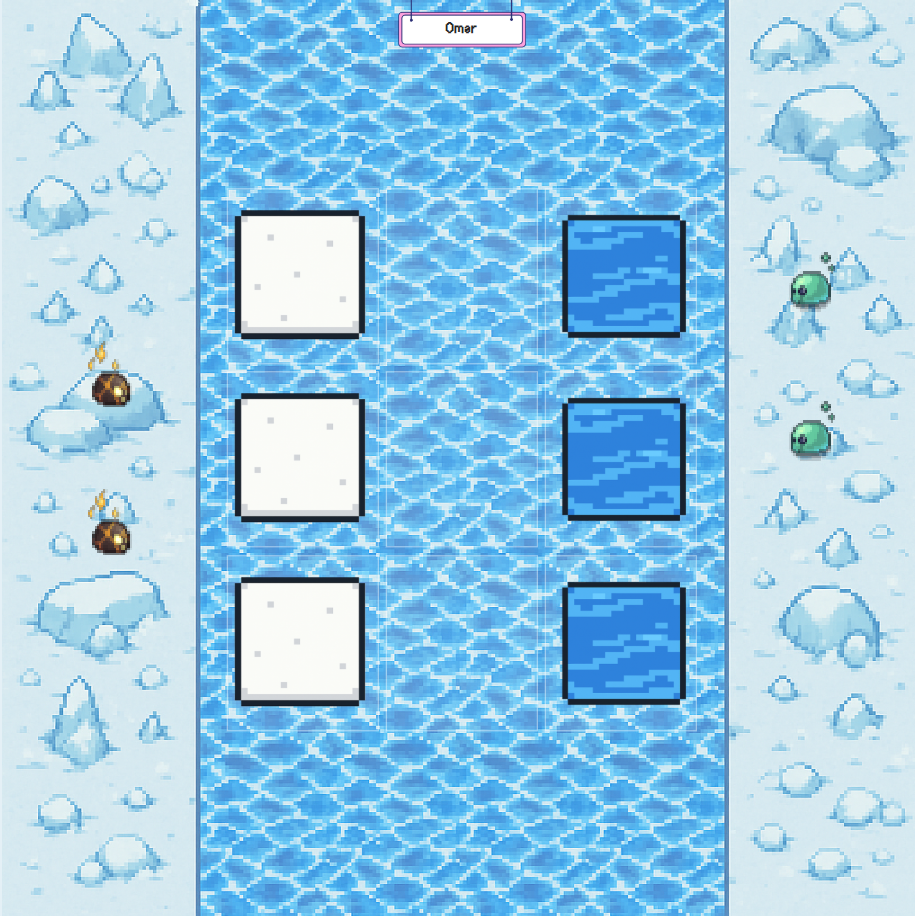

# TactiCross - React Game

A strategic pixel adventure game built with React, TypeScript, and Tailwind CSS.


## Features

### 🏔️ Animated Mountain Background
The starting page features a beautiful animated mountain background using assets from MountainDuskGodot:

- **Parallax Scrolling**: Multiple layers move at different speeds for depth
- **Layered Background**: Sky, clouds, mountains, and trees create depth
- **Smooth Animations**: CSS animations and transitions for fluid movement
- **Responsive Design**: Works on all screen sizes

### 🎵 Background Music
- **Summer Nights**: Atmospheric background music from MountainDuskGodot
- **Audio Controls**: Mute/unmute button with visual feedback
- **Auto-play**: Music starts automatically (with user interaction)

### 🎮 Game Features
- **Multiple Game Modes**: Player vs Player, Survival(Ai)
- **Map Selection**: Choose from different themed environments
- **Player Customization**: Customize your game experience
- **Settings**: Adjust game preferences

### Future Implemntations
- **Tounament Mode**: Tournament mode to add up to 8 players
- **Responsive mobile layout**: allow game to be played on mobile
- **Online mode**: give a rating like in chess.com and allow 1v1 online according to rating
- **Streak Leaderboard**: track Streaks made and display top streaks made and by who

### Ai modes
- **Easy**: makes random moves
- **Medium**: uses Greedy Algorithm to make moves
- **Hard**: uses Minmax Algorithm to make moves

## Getting Started

### Prerequisites
- Node.js (v16 or higher)
- npm or yarn

### Installation

1. Navigate to the project directory:
```bash
cd project
```

2. Install dependencies:
```bash
npm install
```

3. Start the development server:
```bash
npm run dev
```

4. Open your browser and visit `http://localhost:5173`

## Background Assets

The animated background uses the following assets from `public/assets/Menu-Background/MountainDuskGodot/`:

### Image Layers (in order from back to front):
- `MountainsLayers/sky.png` - Static sky background
- `MountainsLayers/far-clouds.png` - Slow parallax clouds
- `MountainsLayers/far-mountains.png` - Medium parallax mountains
- `MountainsLayers/mountains.png` - Faster parallax mountains
- `MountainsLayers/near-clouds.png` - Medium parallax clouds
- `MountainsLayers/trees.png` - Fastest parallax foreground

### Audio:
- `Music/summer nights.ogg` - Background music

## Technical Implementation

### Parallax Effect
The parallax effect is implemented using:
- CSS transforms with `translateY()` and `translateZ(0)`
- JavaScript scroll event listeners
- Different speed multipliers for each layer
- Hardware acceleration with `will-change` and `backface-visibility`

### Audio Management
- HTML5 Audio API for music playback
- User interaction required for autoplay (browser policy)
- Volume control and mute functionality
- Visual feedback for audio state

### Performance Optimizations
- CSS classes for hardware acceleration
- Optimized image loading
- Smooth scrolling behavior
- Efficient event handling

## Customization

### Adding New Background Layers
1. Add your image to the `MountainsLayers/` directory
2. Update the `StartingPage.tsx` component with the new layer
3. Adjust parallax speed by changing the multiplier in `scrollY * [speed]`

### Changing Music
1. Replace `summer nights.ogg` with your audio file
2. Update the audio source in `StartingPage.tsx`
3. Adjust volume levels as needed

### Modifying Animations
- Edit `src/index.css` for custom keyframe animations
- Adjust timing and easing functions
- Add new CSS classes for additional effects

## Browser Compatibility

- Chrome/Edge (recommended)
- Firefox
- Safari
- Mobile browsers (responsive design)

## License

This project uses assets from MountainDuskGodot. Please refer to the original asset licenses for usage terms.

## Development

### Available Scripts
- `npm run dev` - Start development server
- `npm run build` - Build for production
- `npm run preview` - Preview production build
- `npm run lint` - Run ESLint

### Project Structure
```
project/
├── src/
│   ├── components/          # React components
│   ├── types/              # TypeScript type definitions
│   ├── App.tsx             # Main app component
│   ├── index.css           # Global styles and animations
│   └── main.tsx            # App entry point
├── public/
│   └── assets/             # Static assets
└── package.json            # Dependencies and scripts
```
# UI
## Selecting Game Modes 


## Survival Mode
### Setup

### Gameplay

### losing


## PvP
### Setup

### Gameplay + Winning


## Maps 
### Lava

### River

### Polar

